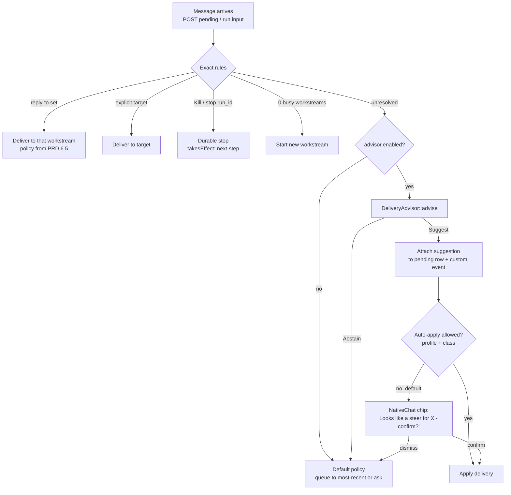

# SPEC: Deterministic delivery advisor (AutoSteer Phase E)

Status: draft for review  
Branch: `auto-steer`  
Parent PRD: [`docs/prd/auto-steer.md`](./auto-steer.md)  
Proposed crate: `pua-pack-autosteer` in [hexuria/pua](https://github.com/hexuria/pua) (see update below)  
Toolchain: Rust 1.99.0 (workspace `rust-toolchain.toml` pin), edition 2024, `#![forbid(unsafe_code)]`  
Default: **off** (config flag)

> **Update 2026-10-05 (codebase analysis).** This spec becomes the **autosteer pack** of the
> [PUA (Predictable Universal Advisor)](https://github.com/hexuria/pua/blob/main/docs/spec.md) spec
> (§6.1 there), as the crate `pua-pack-autosteer` in the separate repo `hexuria/pua`. "Predictable" means
> deterministic: the same input gives the same scores, with no sampling. PUA is tier 0, below Jev.
> Paths below that say `crates/opengrok-advisor/` now mean `packs/pua-pack-autosteer/` in hexuria/pua,
> and opengrok-server or NativeChat would pin it by git tag or rev.
> Three changes override the text below:
> 1. The hook moves from `pending.rs create` to **NativeChat `OnSend::Auto`** in `send_policy.rs`.
>    The server does not decide queue vs steer today. The server route or annotation is optional.
> 2. The steer-splice guard (§5) is **re-scoped**. The splice never rewrites the user's instruction.
>    It inserts clipped tool calls + `STEER_CONTINUATION` (`agui/routes.rs:4870-4977`), so the guard
>    only reports protected spans lost to that clipping.
> 3. Target selection waits for PRD Phase B. Before that, the pack advises delivery class only.

---

## 1. Purpose and non-goals

### 1.1 Purpose

When a message arrives for a conversation that has busy workstreams, and the exact routing
rules did not settle it, the **advisor** suggests:

- a **delivery** (queue, steer, or interrupt), and
- a **target** workstream,

with a confidence, the reasons, and the stage that produced each reason. It may **abstain**.
It is deterministic, CPU-only, and explains every suggestion.

The design follows the *publicly documented* shape of BCorrect's FMM engine (BCSC, John Shoy):
"a fully rule-and-vector-based engine" that protects content, preserves structure, generates
constrained candidates, validates the complete edit, abstains when uncertain, and explains
each result with a `source` (Grammar | Dictionary | Fractal), `puzzle_step`, `confidence`,
`reasoning`, and character offsets. We reuse that **shape** only. We have no access to, and
make no claim about, BCSC's proprietary math ("H-Manifold") or code.

### 1.2 Non-goals

- **Never routes alone.** The advisor returns a suggestion. Server policy or the user decides.
- **Never overrides exact rules:** explicit reply-to, explicit target, Kill / stop on a `run_id`.
- No LLM, no GPU, no network call in the default path.
- No gradient training. Rules and lexicon are hand-written data; vectors are computed by formula.
- Not a general FMM clone and not a grammar checker.
- Not the hyper-use `HgraMatcher` (UI region ranking). Different project, different layer.
- No new storage of message text (see §8).

## 2. Where it sits



Rules:

1. Exact rules run first and are final. The advisor is not called when they match.
2. In v1 of Phase E the advisor **only suggests**; auto-apply is a later, per-class opt-in
   (interrupt is never auto-applied; it always needs a tap or an explicit "stop").
3. Abstain always falls through to the PRD default policy unchanged.

## 3. Outputs

```rust
pub enum Delivery { Queue, Steer, Interrupt, Abstain }

pub struct Advice {
    pub delivery: Delivery,
    pub target: Option<WorkstreamId>,      // None when Abstain or no clear target
    pub confidence_millis: u16,            // 0..=1000, integer: no float drift in the journal
    pub reasons: Vec<Reason>,
    pub trail: Vec<StageRecord>,           // ordered stage trail ("puzzle_step" analogue)
    pub candidates: Vec<Candidate>,        // empty in one-shot mode
    pub has_confusables: bool,             // "has_homoglyphs" analogue
    pub data_version: DataVersion,         // hash of rules + lexicon + seed + profile
}

pub struct Candidate {                     // candidate mode: ranked options for UI chips
    pub delivery: Delivery,
    pub target: Option<WorkstreamId>,
    pub confidence_millis: u16,
}

pub struct Reason {
    pub stage: Stage,                      // PrePass | Lexicon | Rules | Vector | Decision
    pub step: u8,                          // order within the trail
    pub rule_id: Option<RuleId>,           // e.g. "interrupt.stop.v1"
    pub span: Option<Span>,                // byte offsets into the normalized text
    pub text: String,                      // human-readable, e.g. "'stpo' repaired to 'stop'"
}
```

- **One-shot mode** (default): best `delivery` + `target`, or `Abstain`.
- **Candidate mode**: top N (default 3) ranked `Candidate`s for NativeChat chips. Ranking order
  is total and deterministic (§6).
- `Abstain` is a first-class answer, not an error.

## 4. Pipeline stages

Each stage has a fixed step number and writes its tag into `Reason.stage`.

| Step | Stage | BCorrect analogue | Output |
|---|---|---|---|
| 1 | Pre-pass | "protect content, preserve structure" / PPE | normalized text, protected spans, tokens, confusable flag |
| 2 | Lexicon | `source: Dictionary` | repaired control tokens |
| 3 | Rules | `source: Grammar` | delivery cue scores |
| 4 | Vector | `source: Fractal`, "1024D manifold checks" | per-workstream target scores |
| 5 | Decision | profiles, "abstain when uncertain" | `Advice` |
| 6 | Explain | `reasoning`, `puzzle_step`, offsets | `reasons`, `trail` |

### 4.1 Pre-pass

- Unicode NFC normalization (`unicode-normalization`).
- Confusable / homoglyph detection against the Unicode confusables table (`unicode-security`
  or a vendored table). Confusables in control words (Cyrillic `ѕtop`) are flagged and **lower**
  confidence; they are not silently folded into a control action.
- Protected spans: fenced and inline code, URLs, file paths, quoted text (`"..."`, `'...'`,
  `` `...` ``). Protected spans are never repaired by the lexicon and never match rules
  ("the `stop` command is broken" is not an interrupt).
- Tokenization: Unicode word boundaries (`unicode-segmentation`), lowercase fold for matching,
  original byte offsets kept for every token.
- Trait seam `PrePass` so an external cleanup provider can be swapped in (§10).

### 4.2 Lexicon (control-vocabulary typo repair)

- Small closed vocabulary only: control and cue words (`stop`, `cancel`, `abort`, `instead`,
  `actually`, `also`, ...) plus live workstream labels.
- Candidates by SymSpell-style deletes, max edit distance 2 (1 for words of 4 letters or fewer).
- Tie-break by keyboard-adjacency cost (QWERTY), then transposition, then lexical order.
- `stpo` -> `stop`, `cancle` -> `cancel`, `insted` -> `instead`.
- A repair costs confidence (each repair applies a fixed penalty from the profile).
- Ordinary words are never repaired. This is not a spell checker.

### 4.3 Rules (data-driven intent cues)

Rules live in versioned data files under `crates/opengrok-advisor/data/rules/` (TOML, one file
per class, tree-structured like BCorrect's "trees of JSON files"). Loaded once, compiled to an
Aho-Corasick automaton plus a small pattern matcher. No code change to add a cue.

| Class | Example cues (v1 seed) |
|---|---|
| Interrupt | `stop`, `cancel`, `kill`, `abort`, `never mind`, `forget it`, `halt` |
| Steer | `instead`, `actually`, `wait no`, `use X not Y`, `change to`, `switch to`, `rather` |
| Queue | `also`, `after that`, `next`, `then`, `and add`, `when you're done`, `afterwards` |

Each rule: `id`, `class`, `pattern`, `weight_millis`, optional `requires` / `forbids` context,
`version`. Example:

```toml
[[rule]]
id = "interrupt.stop.v1"
class = "interrupt"
pattern = "stop"
weight_millis = 700
forbids = ["negation", "protected_span", "object_is_non_workstream"]
```

Negation and scope:

- Negators within a window of 3 tokens before a cue invert or cancel it:
  "don't stop", "do not cancel", "no need to stop" -> no interrupt score.
- Object scope: "stop X" binds to workstream X if X matches a label (helps §4.4);
  "stop using Postgres" is a **steer**, not an interrupt (verb + gerund pattern).
- Questions ("should I stop?") halve cue weight.
- Conflicting cues are kept; the Decision stage uses the margin (§4.5).

### 4.4 Vector stage (deterministic hyperdimensional scoring)

Purpose: pick a target when no reply-to exists and several workstreams are busy.

- Dimension D = 1024, bipolar (`+1/-1`), stored as 1024-bit packed `[u64; 16]`.
- Token vector: seeded hash (e.g. `xxh3_64` with a fixed seed from the data version) of the
  normalized token expands to 1024 bits via a counter-mode hash. No learned weights.
- Bind (XOR) with role vectors (`ROLE_LABEL`, `ROLE_SUMMARY`, `ROLE_JOURNAL`, `ROLE_MESSAGE`)
  and cyclic shift for position within a small n-gram window (n = 1..3).
- Bundle by majority vote, with a fixed tie-break bit pattern derived from the seed.
- Workstream vector = bundle of label (weight 3), summary (weight 2), last K journal titles
  (weight 1, K = 8). Computed from data the server already holds (§8).
- Score = normalized Hamming similarity (equivalent to cosine for bipolar vectors), as
  integer millis.
- Explicit label mention ("fix the sidebar" when a workstream is labeled `sidebar`) adds a fixed
  bonus via the lexicon match, so exact names beat fuzzy similarity.

Cost: 16 workstreams x 16 `u64` XOR + popcount per score; well inside budget (§8).

### 4.5 Decision

Profiles are thresholds, not different code:

| Profile | Min delivery confidence | Min target score | Min top-2 target margin | Stages |
|---|---|---|---|---|
| `fast` | 850 | 750 | 200 | 1-3, 5 (target only via exact label) |
| `standard` (default) | 750 | 650 | 150 | 1-5 |
| `deep` | 650 | 600 | 100 | 1-5, K = 32 journal titles, n-gram up to 4 |

- Delivery confidence = clamp(sum of matched rule weights - repair penalties - confusable
  penalty - conflict penalty).
- Target requires both the min score **and** the margin over the runner-up; otherwise
  `target = None`.
- Steer or queue without a target -> `Abstain` (we never guess a target for a delivery).
- Interrupt without a target and >1 busy workstream -> `Abstain` + candidates listing each.
- Below thresholds -> `Abstain`. Wrong target is worse than abstain (§9).

### 4.6 Explain

Every `Reason` carries stage, step, rule id, span, and text. Example trail for
"stpo the sidebar one":

```text
1 PrePass  NFC ok; no protected spans; 0 confusables
2 Lexicon  'stpo'@0..4 -> 'stop' (edit 1, adjacency) penalty 50
3 Rules    interrupt.stop.v1 @0..4 +700; object 'sidebar' bound
4 Vector   ws_7 'sidebar' 812, ws_9 'migrations' 401, margin 411
5 Decision Interrupt -> ws_7 confidence 650 (standard: suggest, never auto-apply interrupt)
```

## 5. Steer-splice guard

Today steer is coarse: stop R1 + new R2 + `STEER_CONTINUATION` splice
(`agui/routes.rs`). The guard checks that the spliced history does not lose what the user
constrained.

- Input: original instruction of R1, the steer message, and the composed R2 input.
- Extract protected spans and constraint tokens (paths, identifiers, quoted strings, numbers,
  negated constraints like "don't touch main") from the original and the steer.
- Flag any span present in the original, not contradicted by the steer ("use X not Y" retires
  Y), and missing from the composed R2 input.
- Output: `SpliceReport { dropped: Vec<Span>, retired: Vec<Span>, ok: bool }`, journaled.
- v1 only reports (log + metric). Blocking or re-injecting dropped spans is a later decision.
- Becomes mostly moot after PRD Phase C (same-run inject), but stays useful as a check on the
  inject payload.

## 6. Determinism contract

- Same `InboundMessage` + same `WorkstreamSnapshot`s + same `Profile` + same `DataVersion`
  = byte-identical `Advice`.
- No clock, no RNG, no thread-local state, no `HashMap` iteration order in outputs
  (`BTreeMap` or sorted `Vec` only).
- All scores are integers (millis). No floats in the decision path.
- Fixed seed per `DataVersion`. Tie-break: score desc, then `Delivery` order
  (Interrupt < Steer < Queue for safety ranking), then `WorkstreamId` ascending.
- `DataVersion` = blake3 of (rules files, lexicon, seed, profile table, crate version);
  included in every `Advice`.
- Journal the `Advice` (not the message text again; see §8) on the run / pending row so any
  routing decision can be replayed offline and diffed when rules change.

## 7. Interfaces

### 7.1 Trait

```rust
#![forbid(unsafe_code)]

pub trait DeliveryAdvisor: Send + Sync {
    fn advise(
        &self,
        msg: &InboundMessage,
        live: &[WorkstreamSnapshot],
        profile: Profile,
    ) -> Advice;
}

pub struct InboundMessage<'a> {
    pub text: &'a str,
    pub mode: Mode,                       // OneShot | Candidates { n: u8 }
}

pub struct WorkstreamSnapshot<'a> {
    pub id: WorkstreamId,                 // = run_id in v1
    pub label: &'a str,
    pub summary: &'a str,
    pub recent_journal: &'a [&'a str],    // titles only, newest first
    pub status: WorkstreamStatus,         // Running | WaitingForYou | Stopping
}

pub trait PrePass: Send + Sync {          // swap seam for §10
    fn run(&self, text: &str) -> PrePassOut;
}
```

`advise` is sync, pure, and allocation-bounded. No I/O. The server does the I/O.

### 7.2 Crate layout

```text
crates/opengrok-advisor/
  Cargo.toml            # deps: opengrok-core (ids), unicode-normalization, unicode-segmentation,
                        #       unicode-security, aho-corasick, xxhash-rust, blake3, serde, toml
  data/
    rules/{interrupt,steer,queue,negation}.toml
    lexicon/control.toml
    keyboard/qwerty.toml
  src/
    lib.rs              # trait, Advice, Profile; #![forbid(unsafe_code)]
    prepass.rs  lexicon.rs  rules.rs  hd.rs  decide.rs  explain.rs  splice_guard.rs
    data.rs             # include_str! + compile + DataVersion
  tests/
    golden.rs  determinism.rs  mutation.rs
  fixtures/golden.jsonl
```

Dependency direction follows the workspace rule: advisor depends on `opengrok-core` only;
`opengrok-server` depends on advisor. Data is embedded with `include_str!` so the binary is the
version.

### 7.3 Call site in opengrok-server

- In `agui/pending.rs` `create` (pending user message write), after exact rules
  (`reply_to_ok`, explicit target, stop) and before the queue/steer decision.
- Gather `WorkstreamSnapshot`s for the thread's non-terminal runs from the store.
- Attach `Advice` to the pending row (new nullable `advice` JSON column, or a sidecar table)
  and include it in the pending custom event (`custom_event` / `mutated`) as `advice`.
- Config: `[advisor] enabled = false`, `profile = "standard"`, `mode = "candidates"`,
  `auto_apply = []` (classes allowed to auto-apply; empty in v1).
- Feature-gated with a Cargo feature `advisor` on `opengrok-server` as well, so a build without
  it has zero cost.

### 7.4 NativeChat display

- Suggest: chip on the pending bubble: "Looks like a **steer** for **X** - confirm?"
  with [Confirm] [Queue instead] [Dismiss]. Candidate mode shows up to 3 chips.
- Interrupt suggestion: "Stop **Y**?" with [Stop Y] [No]. Never auto-applied.
- Abstain: nothing shown; default policy applies.
- Tap "why?" reveals `reasons` (stage + text), which is the Explain stage output.
- Confirm sends the explicit target / delivery through the existing exact paths, so the
  final action is always exact.

## 8. Budgets and retention

| Budget | Target |
|---|---|
| `advise` latency | p99 < 5 ms per message, <= 16 live workstreams, single core |
| Rules + lexicon + tables | < 5 MB embedded |
| Steady-state memory | < 16 MB per process (compiled automaton + cached workstream vectors) |
| Splice guard | p99 < 2 ms per splice |

- Benchmarked with `criterion` in CI on the pinned toolchain; regression > 20 % fails.
- Zero new retention: the advisor reads text in memory and returns. It stores nothing.
  The journaled `Advice` contains spans and rule ids, not a second copy of the message.
  Workstream vectors are derived from label / summary / journal titles the server already
  keeps, cached in memory keyed by `(run_id, journal_len, DataVersion)`, and dropped when the
  run ends.

## 9. Evaluation

### 9.1 Golden fixtures

`fixtures/golden.jsonl`, >= 200 labeled messages, each with live-workstream context and the
expected `delivery` + `target` (or `abstain`):

| Slice | Min count |
|---|---|
| Clean interrupt / steer / queue | 30 each |
| Typo variants of cues (`stpo`, `insted`, `alos`) | 30 |
| Negation and scope ("don't stop", "stop using X") | 25 |
| Protected spans (cue inside code / quotes / paths) | 15 |
| Multi-workstream ambiguity (2-6 busy) | 30 |
| Confusables / mixed scripts | 10 |

Seeded from anonymized real journals (with owner consent) plus hand-written cases.

### 9.2 Metrics (reported per profile)

- Precision per delivery class.
- Abstain rate (lower is better only after precision is met).
- **Wrong-target rate: must be ~0 at `standard`** (target: 0 in the golden set; any miss is a
  release blocker). Prefer abstain over a guess.
- Interrupt false-positive rate (must be 0 at `standard`).

### 9.3 Baseline and honesty

- Compare against a plain keyword baseline (lowercase substring match on the same cue lists,
  most-recent workstream as target).
- No claim that the advisor "beats" anything (keyword baseline, LLM classifier, BCorrect)
  without a committed benchmark run against this fixture set.

### 9.4 Property and mutation tests

- `proptest` (workspace dev-dep): same input -> same `Advice`; permuting the `live` slice order
  does not change the result; adding an unrelated idle workstream does not change the target.
- Protected-span property: inserting a cue inside backticks never changes delivery.
- Mutation of rule files: drop or perturb each rule in turn; the golden suite must detect it
  (a rule no test notices is dead or untested).
- Replay: re-run journaled `Advice` with a new `DataVersion`; diff report in CI.

## 10. Optional external adapter: BCorrect API

An alternative `PrePass` implementation that sends text to BCorrect for cleanup before the
Lexicon stage. **Off by default; not part of the Phase E deliverable.**

- Host `bcorrect-api.p.rapidapi.com`, `POST /check`, body `{ text, profile }`, headers
  `X-RapidAPI-Key` (from secret config, never logged), `X-RapidAPI-Host`.
- Use only `corrected_text`, `corrections[].position`, `confidence`, and `has_homoglyphs`;
  map BCorrect corrections into `Reason`s with stage `PrePass` and a `provider = "bcorrect"`
  note.
- Caveats: third party (RapidAPI + Fly.io Toronto), network round trip far above the 5 ms
  budget (server-side "< 15 ms" excludes transit), plan quotas, and the message leaves our
  infrastructure. Requires explicit owner opt-in per deployment.
- Determinism holds only per BCorrect release; record the provider name and API version in `DataVersion`
  when enabled. Fail open to the local pre-pass on timeout (50 ms) or error.

## 11. Phasing, open questions, review

### 11.1 Phasing (aligned to PRD section 9)

| Step | Depends on | Ship | Success check |
|---|---|---|---|
| E0 | none | Crate + golden set, offline CLI over exported journals | Golden metrics reported; wrong-target 0 at `standard` |
| E1 | PRD A | Server call site, `advice` on pending events, flag off | Advice journaled; replay matches |
| E2 | PRD B | NativeChat chips + confirm path | Users confirm/dismiss; telemetry on acceptance |
| E3 | PRD C | Splice guard on inject payload; optional per-class auto-apply (never interrupt) | Dropped-span rate tracked; no auto-apply regressions |

E0 can start now: it needs no server change.

### 11.2 Open questions

1. Where do workstream labels and summaries come from (PRD open question 2)? Vector stage
   quality depends on it.
2. Store `Advice` as a column on the pending row or as a sidecar table?
3. Should `standard` ever auto-apply queue (the safest class), or only after E2 telemetry?
4. Filipino / Taglish cues ("tigil", "teka", "wag na") in v1 seed, or a later rule pack?
5. Do we keep the splice guard after Phase C, or fold it into the inject validator?

### 11.3 Reviewer checklist

- [ ] Exact rules (reply-to, explicit target, Kill / stop) are never reachable from advisor output.
- [ ] Abstain path is the unchanged PRD default policy.
- [ ] No floats, clocks, RNG, or unordered maps in the decision path.
- [ ] `DataVersion` covers every input that can change output.
- [ ] Protected spans are excluded from lexicon repair and rule matching.
- [ ] Interrupt is never auto-applied.
- [ ] No new copy of message text is stored.
- [ ] Config default is off; build without the `advisor` feature compiles and behaves as today.
- [ ] No claim of BCSC internals or "H-Manifold" math; only public docs referenced.
- [ ] Budgets enforced by CI bench on Rust 1.99.0.
