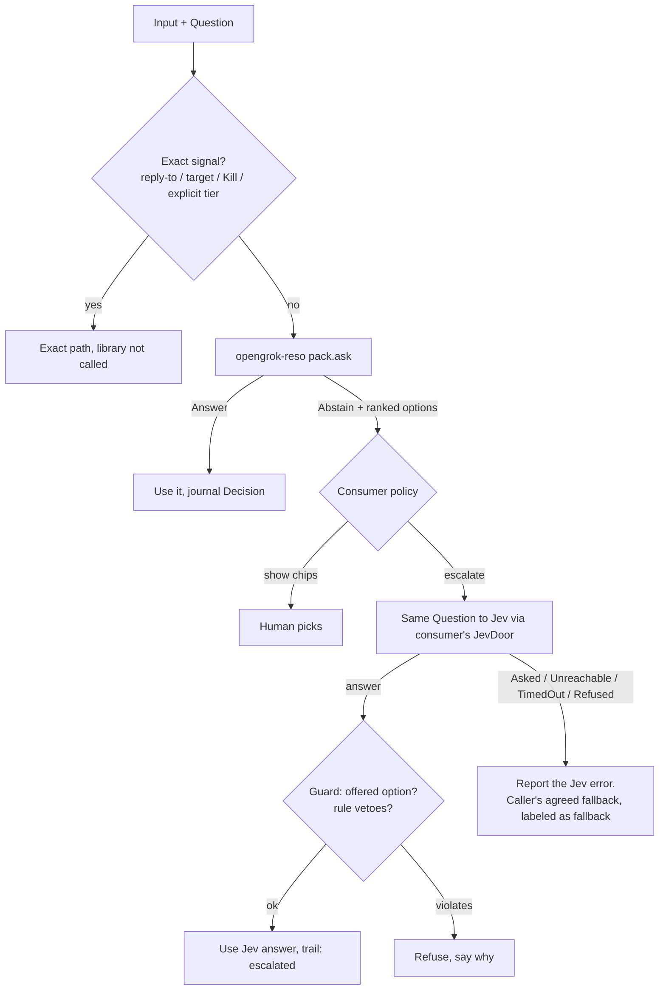

# SPEC: Deterministic resonance library (`opengrok-reso-*` crates)

Status: draft for review  
Branch: `auto-steer`  
Grounding: codebase analysis of 2026-10-05 (box-local `illuminati-steer/codebase-analysis.md`, not committed; cited
below as **A §n**). Upstream code is cited as `repo path:line` at the commits listed in A §0
(opengrok-server `a08635a`, open-ai-gateway `efc906e`, nativechat `c645315`, hyper-use `c074de5`,
buwiz-forms `f8e8cbc`, cred-swap `265d4fe`, gol `4dee334`).  
Supersedes the scope of [`delivery-advisor-spec.md`](./delivery-advisor-spec.md), which becomes the
**autosteer pack** (§6.1).  
Toolchain: Rust 1.99.0 (workspace pin), edition 2024, `#![forbid(unsafe_code)]`, workspace lints
(`unwrap_used = "deny"`).

---

## 1. Goal and non-goals

**Goal.** One family of pure Rust crates **inside opengrok-server** that makes small, closed-world
text decisions:

- deterministic: same input + same data = byte-identical output
- explainable: every answer carries its stage trail and spans in the original text
- abstain-first: it says "not sure" rather than guess
- CPU-only, microseconds to milliseconds, no network

Each product reuses it through thin **packs** (data + adapter).

**Position in the stack.** The library is **tier 0, below Jev**:

| Tier | What | Latency | Output |
|---|---|---|---|
| 0 | `opengrok-reso-*` (this spec) | µs–ms, local | Noul / Choice / Score answer, or **Abstain** |
| 1 | TypeSafe **Jev** (System One decision model) | ~70–500 ms (vendor figure), network | same three shapes, calibrated |
| 2 | Frontier LLM via open-ai-gateway | seconds | generation |

The library is **not** "System One". That term is TypeSafe's name for Jev (A §3;
`/workspace/jev-research/jev-catalog.md:9-17`).

**Non-goals.**

- No LLM, GPU, gradient training, network or async in any library crate.
- Not a grammar checker and not a clone of BCSC's FMM. Their public docs inspired the *pipeline
  shape* only (see the delivery-advisor spec §1.1).
- Never overrides exact signals: reply-to, explicit target, Kill/stop on a `run_id`, explicit tier.
- Never claims a TIN is valid. The check digit is unverified (A §5.1; buwiz-forms
  `rules/shared/tin-validation.json`, `shared-tin-001`).
- Not hyper-use's `HgraMatcher`. hyper-use is credited as prior art and is not a dependency (A §4.2).
  No crate is named `hgra` (hyper-use `docs/DECISIONS.md:5-6`).

## 2. Use cases

| Use case | Stages used | Output | Consumer hook |
|---|---|---|---|
| AutoSteer delivery advice | text, lexicon, rules, (hdc only after PRD Phase B) | Choice{queue, steer, interrupt} or Abstain | NativeChat `plan_send` Auto (§7.1) |
| Workflow `match` step | text, lexicon, rules, hdc | Choice over the step's labels, else escalate to `ask` | opengrok-tools `workflow.rs` (§7.2) |
| Redaction pre-filter | text, rules | Noul per cred-swap candidate, else Jev | opengrok-server `jev/reviewer.rs` (§7.2) |
| Gateway shape features | text | integer feature counts (no tier) | oag-router `RequestSignal` (§7.3) |
| COR OCR label extraction | text (offset map), lexicon | fields + original spans + confidence | buwiz-forms `cor_ocr.rs` (§7.4) |
| BIR field suggestions | text, lexicon, rules | Choice candidates (format repair, catalog codes) | bir-core suggestion contract (§7.4) |
| JevCue intent probe (later) | text, lexicon, rules | Choice or "call Jev" | `/workspace/jev-voice-computer-use/ARCHITECTURE.md:83-97` |

## 3. Crate layout inside opengrok-server

All crates sit flat under `crates/` like the existing workspace (A §1.5), with the prefix
`opengrok-reso-` so the family reads as one unit and is easy to grep:

```text
crates/
  opengrok-reso-core/          Answer, Question shapes, Millis, Span, DataVersion, Stage/Decider traits,
                               profiles, decision (thresholds, top-2 margin, abstain)
  opengrok-reso-text/          NFC, folds (ASCII | Unicode, Ñ-preserving), offset map, protected spans,
                               token and sentence spans, confusable flag
  opengrok-reso-lexicon/       closed vocab: token-boundary exact, longest-known-code, bounded edit
                               distance + QWERTY adjacency; no substring matching by default
  opengrok-reso-rules/         compiled rule packs (cue, negation, scope); no regex in rule data
  opengrok-reso-hdc/           packed bipolar vectors, seeded encoder, bind/bundle/permute,
                               codebook, cleanup, resonator
  opengrok-reso-explain/       trail, reasons, replay record (serde), diff of two replays
  opengrok-reso-jev/           Jev wire shapes (noul/choice/score) <-> core types; NO HTTP client
  opengrok-reso-pack-autosteer/
  opengrok-reso-pack-gateway-shape/
  opengrok-reso-pack-bir-fields/
  opengrok-reso-pack-ocr-labels/
```

Each pack crate holds `data/` (TOML source), a `build.rs` or `include_str!` step that compiles the data
into static tables, an adapter function, and `fixtures/` + `tests/`. This follows buwiz-forms'
`rules/ → crates/bir-rules` codegen pattern, where the data is never parsed at runtime from mutable
files (A §5.1; buwiz-forms `crates/bir-rules/README.md:1-40`).

### 3.1 Dependency rules (`scripts/architecture.txt` additions)

The library must be consumable by repos that don't want opengrok's domain, so **no `opengrok-reso-*`
crate depends on any other opengrok crate, including `opengrok-core`**. Ids cross the boundary as
`&str` / `u64`. This is stricter than "depend only on opengrok-core". It keeps the external dependency
surface to the library crates alone.

```text
opengrok-reso-core:
    | tokio axum sqlx reqwest hyper opengrok-core
opengrok-reso-text: opengrok-reso-core
    | tokio axum sqlx reqwest hyper opengrok-core
opengrok-reso-lexicon: opengrok-reso-core opengrok-reso-text
    | tokio axum sqlx reqwest hyper opengrok-core
opengrok-reso-rules: opengrok-reso-core opengrok-reso-text opengrok-reso-lexicon
    | tokio axum sqlx reqwest hyper opengrok-core
opengrok-reso-hdc: opengrok-reso-core
    | tokio axum sqlx reqwest hyper opengrok-core
opengrok-reso-explain: opengrok-reso-core
    | tokio axum sqlx reqwest hyper opengrok-core
opengrok-reso-jev: opengrok-reso-core
    | tokio axum sqlx reqwest hyper opengrok-core typesafe-sdk
opengrok-reso-pack-*: opengrok-reso-core opengrok-reso-text opengrok-reso-lexicon opengrok-reso-rules opengrok-reso-hdc opengrok-reso-explain
    | tokio axum sqlx reqwest hyper opengrok-core
```

Existing crates get new allowed edges only where §7 hooks them:

- `opengrok-server`: `+ opengrok-reso-core opengrok-reso-jev opengrok-reso-pack-autosteer`
- `opengrok-tools`: `+ opengrok-reso-core opengrok-reso-rules` (workflow `match` step)

`opengrok-reso-jev` bans `typesafe-sdk` because the SDK is a network client (reqwest), and versions
already differ: opengrok-server `0.1`, gateway `=0.2.0`, hyper-use `0.2` (A §2.3, §10 q9). The adapter
mirrors Jev's wire JSON as used by `POST /jev/ask` (`opengrok-server src/jev/routes.rs:1-54`), and each
consumer converts to its own SDK version.

Other workspace gates that apply:

- Default crate ceiling of 8,000 src lines (`scripts/crate-ceilings.txt`). Splitting into several crates
  keeps each one under it.
- `deny.toml:37-50` licenses. The candidate deps fit: `unicode-normalization`, `unicode-segmentation`,
  `unicode-security`, `aho-corasick` (already used by cred-swap), `blake3`.
- Crates must build with `--no-default-features` and need **no Postgres**. CI should add a
  `reso` suite (`cargo test -p 'opengrok-reso-*'`) next to the existing suites in `.github/workflows/ci.yml`.

### 3.2 How other repos consume it

Every consumer is public, and so is opengrok-server (checked 2026-10-05), so CI needs no git auth.
Consumers take a **git dependency pinned by `rev` or tag**, the way opengrok-server already pins
`grok-box` (`Cargo.toml:53`, `rev = "6af8ae6"`). They don't track a branch, which is how cred-swap is
pulled today (`crates/opengrok-server/Cargo.toml:40`):

```toml
# nativechat / open-ai-gateway / buwiz-forms Cargo.toml
opengrok-reso-core = { git = "https://github.com/hexuria/opengrok-server", tag = "reso-v0.1.0" }
opengrok-reso-pack-autosteer = { git = "https://github.com/hexuria/opengrok-server", tag = "reso-v0.1.0" }
```

- **Tags.** `reso-vMAJOR.MINOR.PATCH`, cut on opengrok-server `main`. The `CHANGELOG` lives in
  `crates/opengrok-reso-core/CHANGELOG.md`. A change to rule or lexicon data that alters output bumps
  MINOR and changes `DataVersion` (§5).
- **Local development.** `[patch."https://github.com/hexuria/opengrok-server"]` with `path = "../opengrok-server/crates/..."`.
- **Toolchains.** The library MSRV stays ≤ 1.99 and stable-only, because buwiz-forms builds on
  `stable` and cred-swap is unpinned (A §6).
- **If opengrok ever embeds the gateway again** (CLAUDE.md fact 2; no Cargo edge exists at `a08635a`):
  the gateway's git dependency and opengrok's path crates would be two copies of the same crate.
  opengrok's root `Cargo.toml` must then `[patch]` the git source to the local paths.

**Coupling risk (accepted by owner decision, mitigated):**

| Risk | Mitigation |
|---|---|
| Library releases ride opengrok-server's gate, CI prefixes and review queue | Separate `reso` CI suite; tags decouple consumer upgrades from `main` |
| Consumers clone a ~10 MB repo with unrelated crates | Git dep resolves only the named packages; accept clone cost |
| A server refactor breaks external consumers | Library crates have no opengrok edges (§3.1); CI job builds each `opengrok-reso-*` crate alone with `--locked` |
| Domain packs (BIR, gateway) live in a repo their owners don't otherwise touch | CODEOWNERS per pack dir; open question q3 on moving packs to consumers later |
| Workspace `rust-version = "1.90"` vs 1.99 pin | Library sets its own `rust-version` per crate and CI checks MSRV |

## 4. Core pipeline

```text
text ─► normalize (+offset map, protected spans) ─► lexicon (candidates, typo repair)
     ─► rules (cues, negation, scope) ─► hdc (codebook similarity, cleanup, resonator)
     ─► decide (profile thresholds, top-2 margin, abstain) ─► explain (trail, DataVersion)
```

### 4.1 Traits (`opengrok-reso-core`)

```rust
#![forbid(unsafe_code)]
pub struct Millis(pub i16);                  // -1000..=1000 similarity, 0..=1000 confidence
pub struct Span { pub start: u32, pub end: u32 } // byte offsets into the ORIGINAL text

pub enum Question<'a> {                      // Jev's three shapes (A §3; workflow.rs:253-330)
    Noul   { name: &'a str },
    Choice { name: &'a str, options: &'a [Opt<'a>] }, // option 0 is the safe default (workflow.rs:315-330)
    Score  { name: &'a str, levels: &'a [&'a str] },
}

pub enum Answer {
    Noul   { yes: bool, confidence: Millis },
    Choice { option: u16, confidence: Millis, ranked: Vec<(u16, Millis)> },
    Score  { level: u16, confidence: Millis },
    Abstain { why: AbstainReason, ranked: Vec<(u16, Millis)> },
}

pub trait Stage   { fn run(&self, input: &StageInput, trail: &mut Trail); }
pub trait CandidateGen { fn candidates(&self, text: &Normalized, out: &mut Vec<Candidate>); }
pub trait Scorer  { fn score(&self, c: &Candidate, ctx: &Context) -> Millis; }
pub trait Decider { fn decide(&self, q: &Question, scored: &[Scored], p: Profile) -> Answer; }
pub trait Pack: Send + Sync {
    fn data_version(&self) -> DataVersion;
    fn ask(&self, q: &Question, input: &PackInput, p: Profile) -> Decision; // Answer + Trail
}
```

Every call is sync and pure. Allocation is bounded by the input length and the pack size.

### 4.2 Text with an offset map (`opengrok-reso-text`)

- **NFC first.** Then a fold chosen per pack:
  - `AsciiLower`: what `intent.rs:88-94` does today.
  - `UnicodeCaseFold`: keeps `Ñ` / `ñ` as letters and folds case only. This is the default for
    bir-fields and ocr-labels.
- **Unicode-safe by test.** `fold("PEÑA") == "peña"`, never `"pe a"`. The ASCII-only maps in buwiz-forms
  turn `PEÑA` into `PE A` (`bir-core/src/profile.rs:193-206`, `bir-desktop/src/cor_ocr.rs:753-767`;
  A §5.1).
- **Offset map.** Every normalized byte maps back to an original byte range. Every span the library
  returns is in **original** coordinates. This is the fix for the COR bug, where offsets computed on
  normalized text were applied to raw text (A §5.3; `cor_ocr.rs:705-750`).
- **Protected spans.** Fenced and inline code, URLs, paths, quoted text, version numbers and decimals are
  never repaired or matched inside (`intent.rs:244-249`).
- **Sentence and token spans** as byte ranges, ported from `intent.rs:166-198`.
- **Confusables.** Mixed-script and homoglyph flags. A confusable inside a control word lowers
  confidence and is never silently folded into an action.

### 4.3 Lexicon (`opengrok-reso-lexicon`)

- Matching is token-boundary by default. **Substring matching is opt-in per entry** and refused for
  entries under 5 chars. This is the "tin matched setting" lesson (`intent.rs:112-115`).
- **Longest exact known code** across up to 3 adjacent tokens, never by prefix (`cor_ocr.rs:661-680`).
- **Typo repair** for closed vocabularies only, SymSpell-style:
  - max edit distance 1 for words of ≤ 4 chars, 2 otherwise
  - tie-break by QWERTY adjacency, then transposition, then lexical order
  - each repair costs a fixed number of millis
- **OCR confusions** as a separate table (O↔0, l↔1↔I, S↔5, B↔8), only for fields declared numeric.

### 4.4 Rules (`opengrok-reso-rules`)

- Source is TOML in the pack's `data/`, compiled at build time into Aho-Corasick automata + small
  matchers.
- **No regex in rule data.** Persisted regex is "a dialect question nobody can answer later"
  (`workflow.rs:201-214`).
- Rule fields: `id`, `class`, `pattern` (literal tokens with `{slot}`), `weight_millis`, `requires`,
  `forbids`, `version`.
- Negation window (default 3 tokens), object scope ("stop X" binds to X; "stop using X" is a steer), and
  a question damper. Conflicting cues are kept and resolved by margin.

### 4.5 HDC stage (`opengrok-reso-hdc`)

- **Vectors.** Bipolar, packed as `[u64; D/64]`. D ∈ {1024 (default), 2048, 4096}.
- **Encoder.** Algorithm credited to hyper-use: FNV-1a seed over `namespace‖0x1f‖symbol‖0x1f‖version`
  plus **our own tag `opengrok-reso-hv1`**, expanded by SplitMix64 (hyper-use
  `crates/hyper-use-hyper/src/lib.rs:157-211`). It's ported, not depended on, because hyper-use's seed
  hard-codes `"hyper-use-hv1"` (`:197`) and uses `Vec<i8>` + f64 (A §4.2).
- **Algebra.**
  - bind = XOR (bipolar multiply)
  - permute = rotate by a relation-derived shift
  - bundle = **integer-weighted** majority, with i32 accumulators and a zero → +1 tie
  - similarity = `Millis((D − 2·hamming)·1000 / D)` via popcount
- **Codebook.** An item memory of `(id, vector)` sorted by id, built deterministically from pack data:
  - Atomic symbols are encoded directly.
  - Composite entries (labels, workstream summaries) are bundles of position-permuted token n-grams
    (n = 1..3) bound to role vectors.
  - No gradient training. The codebook is a pure function of the pack data and the seed tag.
- **Cleanup.** The nearest codebook entry, by similarity, then id. To decode the top k members of a
  bundle, iterate: find the nearest, subtract its contribution from the integer accumulator, repeat up to
  k times. Stop early when the best similarity drops below the profile floor.
- **Resonator** (new; no prior code in the org, A §4.2). It factorizes a composite query
  `q = a ⊗ b` with `a ∈ A`, `b ∈ B` (e.g. intent ⊗ target):
  - Start with `â = bundle(A)` and `b̂ = bundle(B)`.
  - Iterate `â ← sign(Σ_i sim(q ⊗ b̂, a_i) · a_i)` with integer sims, and symmetrically for `b̂`.
  - Stop at a fixed point or after **16 iterations**, whichever comes first.
  - Output the converged pair plus both margins, or `Abstain(NotConverged)`.
  - There is no randomness. Ties go to the lower id.
- **What this buys.** Soft matching ("the sidebar one" matches workstream `sidebar fix`) while the result
  stays a pure function of the input.
- **Capacity is measured, not assumed.** L0 publishes a table of cleanup accuracy against bundle size and
  codebook size for each D, following hyper-use's capacity smoke pattern (`tests/capacity.rs:1-40`).
- **Speed.** hyper-use needed about 2 s debug for 2,000 regions with `Vec<i8>` (A §4.1). The packed
  layout exists to stay inside the §5.3 budgets.

### 4.6 Decide

Profiles are tables, not code paths:

| Profile | min confidence | min top-2 margin | stages | resonator |
|---|---|---|---|---|
| `fast` | 850 | 200 | text, lexicon, rules | off |
| `standard` | 750 | 150 | all | cleanup only |
| `deep` | 650 | 100 | all | on |

Below the minimum confidence or margin, the answer is `Abstain` carrying the ranked candidates, so the
caller can show chips or escalate with the same options.

### 4.7 Explain (`opengrok-reso-explain`)

The trail is an ordered list of records `{step, stage, rule_id?, span (original coords), millis, text}`
plus `DataVersion`. A replay record is `(input hash, inputs needed to re-run, Answer, Trail)`.
`diff(replay_a, replay_b)` reports changed answers when `DataVersion` moves.

## 5. Determinism and replay contract

1. Same `(input, pack DataVersion, profile)` gives a byte-identical `Decision`.
2. **No floats in the decision path.** Scores are `Millis(i16)`, weights are integers, and accumulators
   are i32. A float can enter only at an adapter boundary: Jev's f64 probabilities are converted once, in
   `opengrok-reso-jev`. A noul probability is not a confidence (`opengrok-server src/jev/routes.rs:36-52`).
3. No clocks, RNG, environment reads, thread-locals, or `HashMap` iteration in outputs (`BTreeMap` or
   sorted `Vec`).
4. Stable tie-break: score descending, then the option order the question declared, then id ascending.
5. `DataVersion = blake3(crate version, seed tag, D, compiled rules, lexicon, codebook, profile table)`.
   It goes into every `Decision` and every replay record.
6. Consumers journal the `Decision`, not a second copy of the text, next to data they already keep (§8).

### 5.1 Tests that enforce it

- `proptest`: same input gives the same output; permuting the order of live candidates leaves the answer
  unchanged; an unrelated codebook entry leaves the answer unchanged; a cue inside a protected span never
  changes the answer. Pattern from hyper-use `tests/rank_props.rs:41-75`.
- Unicode fixtures: `PEÑA`, `Ñiño`, combining-mark vs precomposed `Ñ`, Cyrillic `ѕtop`.
- Offset-map property: for every returned span, `original[span]` folds to the matched normalized text.
- Mutation testing: `cargo mutants --in-diff` on library crates, following the gateway
  (`open-ai-gateway scripts/mutants-diff.py:1-15`).

### 5.2 Budgets

| Path | p99 target (single core, release) |
|---|---|
| autosteer `ask` (≤ 16 live candidates) | < 2 ms |
| text normalize, 32 KB input | < 1 ms |
| cleanup over a 4,096-entry codebook, D = 1024 | < 1 ms |
| resonator, \|A\| = \|B\| = 64, ≤ 16 iterations | < 5 ms |

Embedded data per pack must stay under 5 MB. A CI bench (`criterion`) fails on a > 20 % regression.

## 6. Packs

### 6.1 `opengrok-reso-pack-autosteer`

This was `delivery-advisor-spec.md`. The question is
`Choice{ name: "delivery", options: [queue (safe default), steer, interrupt] }`.

- **Phase E before PRD Phase B: delivery class only.** A thread has at most one live run in practice
  (A §1.2; `opengrok-server crates/opengrok-server/src/agui/pending.rs:649-667`), so there is no target
  to pick.
- **After Phase B: add target selection.** It uses HDC over per-run snapshots. **No workstream label or
  summary exists today** (A §1.2), so a snapshot is built from:
  - the first user line of `Run.prompt`, in the style of `title_of`
    (`crates/opengrok-server/src/agui/history.rs:599-613`)
  - tool names from `TOOL_CALL_START` in `Run.emitted`
  - `skill_id`
- **Splice guard, re-scoped.** The splice doesn't rewrite the user's instruction. It inserts tool calls
  clipped to 400 / 800 chars (cap 8) plus `STEER_CONTINUATION` before the latest user message
  (`crates/opengrok-server/src/agui/routes.rs:4870-4977`; A §1.1, finding 2). The guard reports only
  **protected spans lost to that clipping** (paths, ids, error codes) as a metric. Owner may drop it.
- Interrupt is **never auto-applied**.

### 6.2 `opengrok-reso-pack-gateway-shape`

- Emits **integer shape features only**: fenced-code and diff counts, dominant script, homoglyph count,
  JSON or structured-output request.
- It **never maps wording to a tier**. That respects `oag-router/src/classify.rs:98-100` and
  `oag-core/src/config.rs:456-470` (A §2.1).

### 6.3 `opengrok-reso-pack-bir-fields`

- Format repair suggestions for TIN segments and branch code (`000-000-000-00000`), using the OCR
  confusion table on digits only.
- RDO and form-code catalog matching (longest exact known code). Ñ-preserving name fold.
- Output is always a **suggestion** with a reason. The string "valid" is never emitted for a TIN.
  bir-rules owns validation (A §5.1).

### 6.4 `opengrok-reso-pack-ocr-labels`

- COR (BIR Form 2303) label vocabulary from `cor_ocr.rs:614-646`.
- Label extraction through the offset map, so values come back as original-text spans.
- Per-field confidence from the match type (exact label, repaired label, next-line value) instead of the
  hard-coded `0.6` (`cor_ocr.rs:418-422`).

## 7. Consumers and exact hook points

### 7.1 NativeChat: `OnSend::Auto` (first consumer)

- **`src/send_policy.rs:10-69`.** Add `OnSend::Auto`. `plan_send(busy, on_send, force_steer, advice)`:
  - `Idle` → Post, unchanged.
  - `Parked` → Steer, unchanged.
  - `Running` + Auto → map the autosteer `Answer`:
    - `queue` → Queue
    - `steer` with confidence ≥ the profile minimum → Steer, but only if the user enabled auto-steer;
      otherwise show a chip
    - `interrupt` → chip "Stop this turn?" (never automatic)
    - `Abstain` → Queue, which is today's default
- **Safe rollout.** Older builds read the stored word `auto` as Queue (`send_policy.rs:21-28`), so the
  preference can't turn into an interrupt on them.
- **`src/state.rs:20176-20182`.** Compute advice between `busy_state` (`:7191-7206`) and `plan_send`. An
  explicit `self.reply_to` (`:5399`, taken at `:20196`) aimed at the busy turn skips the library entirely.
- **UI.** A new suggestion element above the composer or on the queued bubble. The existing chips are
  text-in-field (`components/chat_input/mod.rs:186-197`) and can't host it. Register gpui-agent stable
  ids in `src/agent/host.rs`.
- Runs locally: zero network, works offline. Default off.

### 7.2 opengrok-server (optional, flag `[reso] enabled = false`)

| Hook | Where | Shape |
|---|---|---|
| O1 advise route | new `POST /ag-ui/threads/{id}/advise`, pure | `{answer, trail, dataVersion}`. Server-authoritative variant of 7.1 (CLAUDE.md #6) |
| O2 queued-message annotation | `agui/pending.rs:323-374` `create` → `mutated`/`custom_event` (`:134-145`, `:298-305`) | `advice` field: "this queued message looks like a steer/stop" |
| O3 workflow `match` step | `opengrok-tools/src/workflow.rs` beside `When` (`:384`) and `Ask` (`:390-400`) | deterministic label or **escalate to the step's `ask`** |
| O4 reviewer pre-filter | `src/jev/reviewer.rs:127` before the Jev call | decide obvious spans locally, send only ambiguous ones (reviewer not yet wired, A §1.4) |

Wire shapes for O1 and O2 land together with their NativeChat consumer ("transcribed, never invented",
CLAUDE.md #1).

### 7.3 open-ai-gateway (advisory shape features only)

- Add integer features to `RequestSignal` (`oag-router/src/classify.rs:17-36`), filled in
  `oag-proto/src/canonical.rs:551-570`.
- `HeuristicClassifier` keeps choosing tiers. A routing-diff test must show **zero tier changes**
  unless an operator flag opts in (`canonical.rs:683,1079` warn that signal drift re-routes deployments).
- Optional advisory text gate:
  - Non-streamed responses: a new `QualityGate` variant. The enum is already `#[non_exhaustive]`
    (`oag-router/src/policy.rs:166-188`).
  - Streamed responses: ledger-only, because bytes already sent can't be re-gated
    (`oag-server/src/gateway/sse.rs:489-494`; A §2.2).
- The System One passthrough stays byte-for-byte (`oag-server/src/lib.rs:132-139`).
- Needs owner sign-off (open question q4).

### 7.4 buwiz-forms

- **COR OCR fix.** Replace `normalize` / `label_offset` / `extract_label_value`
  (`crates/bir-desktop/src/cor_ocr.rs:705-767`) with `opengrok-reso-text` spans + the ocr-labels pack.
  The bug fix itself should not wait for the library: it is a small local change (A §5.3, q6).
- **Ñ-safe classification.** `classify_vat_registration_text` (`crates/bir-core/src/profile.rs:193`)
  moves to the Unicode fold.
- **Field checks.** A new suggestion type beside `RuleViolation` (`crates/bir-rules/src/issue.rs:185`)
  in bir-core, filled by bir-fields. It is never a validity verdict.

## 8. Escalation to Jev (no silent fallback)



- **Same shape both ways.** The library's `Question` is the one Jev gets. `opengrok-reso-jev` renders it
  as Jev wire JSON (`instructions`, `choices`, `levels`, `yesMeans`/`noMeans`, as in
  `src/jev/routes.rs:1-22`) and parses the reply into `Answer`, converting floats once.
- **Guard.** A Jev answer outside the offered options is an error. That's the gol and hyper-use rule
  (`hyper-use-cli/src/compare.rs:74`; gol `docs/architecture.md:25`). Pack vetoes still apply, so a
  negated "don't stop" can't become an interrupt.
- **No silent fallback.** Jev's four error kinds stay distinct (`src/jev/mod.rs:84-104`). Any fallback is
  the caller's declared one (the per-kind rules in `opengrok-tools/src/workflow.rs:315-330`), recorded in
  the trail as `fallback`, never as an answer the library or Jev gave.
- **Feedback (speculative, L3).** Jev-confirmed decisions are exported from consumer journals, reviewed by
  a person offline, and turned into new rules or codebook entries. Merging them changes `DataVersion`.
  Nothing learns online.

## 9. Evaluation per pack (no claims without a committed run)

| Pack | Fixture set | Must hold at `standard` | Compare against |
|---|---|---|---|
| autosteer | ≥ 200 labeled messages: clean, typo, negation, protected span, confusable; target slice after Phase B | interrupt false-positive = 0; wrong-target = 0; precision per class reported | keyword baseline; `plan_send` default (always queue) |
| gateway-shape | canonical requests with known code / diff / script | feature accuracy 100 % on fixtures; routing diff = 0 tier changes | `HeuristicClassifier` alone |
| bir-fields | TIN formats, RDO / form codes, Filipino names (`PEÑA`, combining marks) | never emits "valid"; Ñ round-trips; suggestion precision reported | current trim-only behaviour |
| ocr-labels | COR sidecar texts incl. leading spaces, double spaces, multibyte before labels | the three A §5.3 cases extract correctly; field exact-match reported | current `parse_cor_text`; Gemini path where fixtures exist |
| hdc (core) | synthetic codebooks | capacity table published; resonator convergence rate reported | none (it's a measurement) |
| Jev agreement | per pack, recorded | agreement / abstain matrix | Jev via `hyper-use-cli/src/compare.rs:224-260`-style harness; live runs nightly only |

## 10. Phasing

| Phase | Ships | Gate |
|---|---|---|
| **L0** | `opengrok-reso-core/text/lexicon/rules/hdc/explain`, autosteer pack offline CLI over exported journals, `reso` CI suite, architecture.txt lines | determinism proptests green; Unicode fixtures green; autosteer golden metrics reported; capacity table |
| **L1** | NativeChat `OnSend::Auto` (suggest-only chips); `opengrok-reso-jev` shapes; gateway-shape pack behind flag | Auto off by default; zero tier changes in gateway diff |
| **L2** | ocr-labels + bir-fields packs; buwiz-forms adopts `opengrok-reso-text` (bug fix may land earlier on its own); workflow `match` step (O3) | A §5.3 fixtures; no TIN validity claims |
| **L3** | Jev loop: escalation wiring (O3 → `ask`, O4 reviewer, JevCue probe), agreement harness, offline feedback to packs | agreement matrix per pack; every fallback labeled |

Each step fits PRD Phase E (`auto-steer.md` §9). Target selection waits for PRD Phase B.

## 11. Changes from `delivery-advisor-spec.md` (the 12 from A §9)

1. Call site moves from `pending.rs create` to NativeChat `plan_send` Auto, with an optional server route
   or annotation (§7.1–7.2).
2. Target selection only after PRD Phase B (§6.1).
3. Splice guard re-scoped to clipped protected spans (§6.1).
4. Workstream snapshot built from `Run.prompt` / `emitted` / `skill_id`, since labels don't exist (§6.1).
5. Tier 0 below Jev, not "System One". Jev's shapes, no silent fallback (§1, §8).
6. Offset map + Ñ-preserving fold; no substring cues; no regex in data (§4.2–4.4).
7. Packs compiled at build time, with TOML as source only (§3, §4.4).
8. HGRA credited to hyper-use but not depended on; own seed tag; cleanup / resonator marked new (§4.5).
9. Gateway: shape features or advisory gate only (§6.2, §7.3).
10. Forms: suggestions only, no TIN validity (§6.3, §7.4).
11. Crate home: inside opengrok-server, with dependency rules and external consumption (§3). This
    differs from the analysis' separate-repo lean, per owner decision.
12. Float boundary: floats converted once in `opengrok-reso-jev`, millis inside (§5).

## 12. Open questions (from A §10, updated)

1. What exactly is hyper-use's "JEV loop": gol's `JevDecider` loop, JevCue, or something planned?
2. Should Auto delivery be decided client-side (NativeChat, offline) or server-side (O1), or both with the
   server authoritative?
3. Should domain packs (bir-fields, ocr-labels, gateway-shape) stay in opengrok-server, or move to their
   consumer repos once core is tagged?
4. Gateway stance: are text-derived shape features in `RequestSignal` acceptable?
5. TIN check digit: is a verified `chkt.exe` algorithm available anywhere?
6. COR bug (A §5.3): fix it in buwiz-forms now, independent of L2?
7. Is `jev/reviewer.rs` planned for a request path, and is the O4 pre-filter wanted?
8. Which Filipino name, place (PSGC) and RDO lists are licensed for embedding?
9. Align typesafe-sdk versions (0.1 / `=0.2.0` / 0.2) before any consumer-side Jev conversion.
10. Fix the stale comment at `src/jev/mod.rs:18-23`: the gateway now hosts Jev.
11. Tag scheme: `reso-v*` tags on opengrok-server, or `rev` pins only?

## 13. Reviewer checklist

- [ ] No `opengrok-reso-*` crate depends on another opengrok crate or on tokio, axum, sqlx, reqwest, hyper or typesafe-sdk.
- [ ] `scripts/architecture.txt` and `crate-ceilings.txt` updated in the same change as the crates.
- [ ] No floats, clocks, RNG or unordered-map iteration in the decision path; `DataVersion` in every output.
- [ ] Every returned span indexes the original text; `PEÑA` never becomes `PE A`.
- [ ] No substring cue under 5 chars; no regex in rule data.
- [ ] Exact signals bypass the library; interrupt never auto-applies; Abstain means today's default.
- [ ] Jev escalation uses the same Question; off-menu answers are refused; fallbacks are labeled.
- [ ] Gateway routing diff shows zero tier changes by default.
- [ ] Nothing claims TIN validity.
- [ ] External consumers pin a `rev` or `reso-v*` tag, never a branch.
