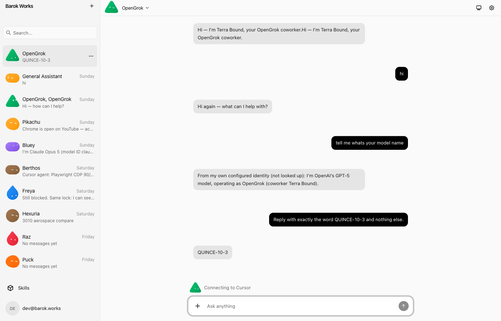

# Bot ↔ coworker binding — verification

Slice 10.3, verified 1 Sep 2026 against the live OpenGrok on `:1447` and barok-works
on `:3010`/`:3021`. The proof is a browser send, not a curl; "the Bot replied" is
not enough — see below.

## What 10.1 and 10.2 already held

A bot key minted at `POST /coworkers/{id}/keys` names the account **and** the
coworker. A bare `POST /ag-ui` with `Authorization: Bearer <key>` runs as that
coworker, owned by the minting account. A revoked or unknown-but-verifying key
answers **401**, not anonymous.

Curl of a freshly minted Hexuria key, before the browser send:

```
thread t-10-3-bind-check
run    r-10-3-bind-check
  account_id  = acct_01a0551e-29ad-74b3-b1d6-236a8122d6d8
  coworker_id = cw_01a058dd-0052-7db2-a116-4c62276a9113   -- Hexuria
```

## The first browser send was a lie

barok-works Bot `agent_d8432b1e-44f6-4ed8-acbc-864b0cd9ce98` (name OpenGrok,
`hasAuth: true`, endpoint `http://127.0.0.1:1447/ag-ui`) sent
`POMEGRANATE-10-3` from `/bot`. The model answered. Two new `run_view` rows
appeared. Both had `account_id` **null** and `coworker_id` **null**.

That is the anonymous path `principal_from_bearer` takes when the header is
missing **or** the token does not verify: `Ok(None)`, tools stripped, the
deployment's model, a 200. The Bot looks like it worked.

The vault value did start with `Bearer ` — the prefix was not the miss. The
stored JWT's `jti` (`bk_01a050fd-2076-71b0-a88b-a27477d1a16e`) was **not in
`bot_key_view`**. Its `sub` was `acct_01a050c4-…`, an earlier OpenGrok account,
not the live `acct_01a0551e-…`. A token that does not verify is indistinguishable
from no header at all.

The stale package Bot `opengrok` was already gone (hide returned 404). Discriminate
by `hasAuth`, not by name.

## Rebound, then one quiet-machine send

Minted a live key for Hexuria (`jti=bk_01a05c0d-1155-7e71-99cc-864d1bac5921`),
stored in barok's vault as the full `Authorization` value (`Bearer <jwt>` — barok
sends the vault value verbatim and never prefixes). Then one send from the
OpenGrok channel at `http://localhost:3010/channel/channel_19e47306-cff3-4ce2-9553-912fb0d5be17`:

> Reply with exactly the word QUINCE-10-3 and nothing else.

The Bot answered `QUINCE-10-3`. The new run:

```
id          f153f8ba-fa3a-42cc-bfb4-8d10fcfa2dcf
owned       t
account_id  acct_01a0551e-29ad-74b3-b1d6-236a8122d6d8
thread_id   55569917-dab5-8127-b34a-0b3798d6c684     -- not gateway-<coworker>
coworker_id cw_01a058dd-0052-7db2-a116-4c62276a9113 -- Hexuria
updated_at  1788250847794
```

Thread id is an Intelligence UUID, not the desktop's `gateway-<coworker>` shape,
so this is the barok hop.



## What to distrust next time

- `hasAuth: true` means a vault row exists, not that the row is a key *this*
  OpenGrok will honour.
- A verifying-but-unknown jti is 401. An unverifiable token is anonymous. Only
  `run_view.account_id` tells them apart.
- barok's `/api/agents?hidden=true` did not list this Bot even though GET-by-id
  returned it; address it by id.
